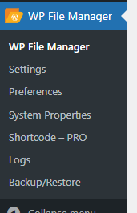
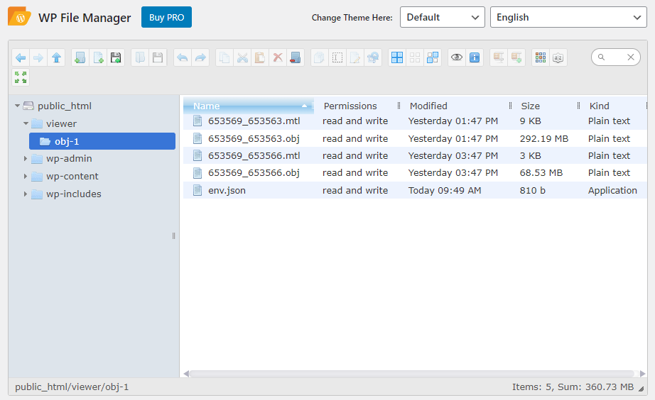
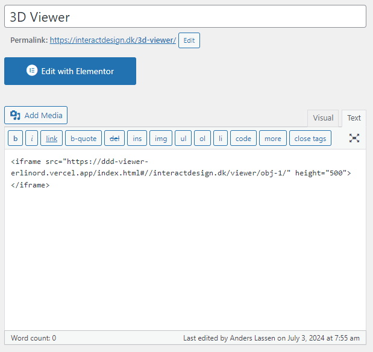
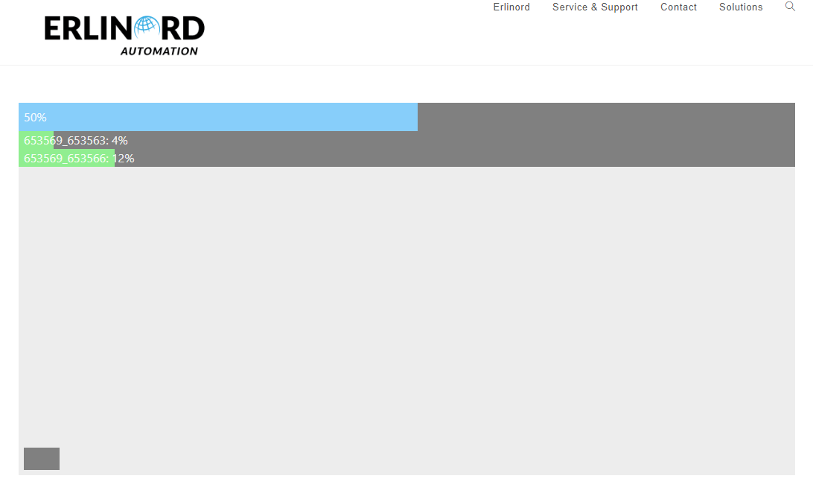
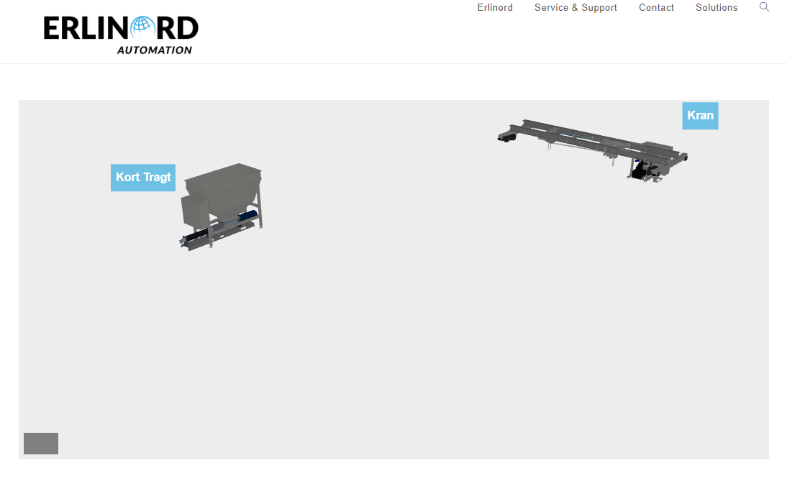
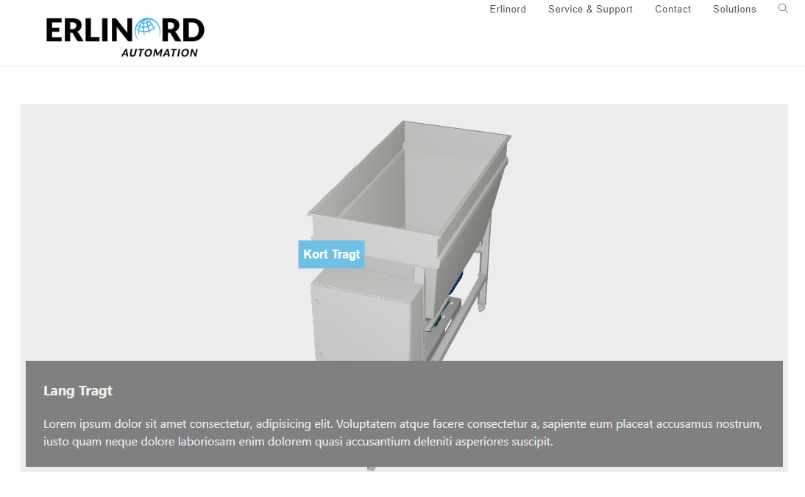

# 3D Viewer

Udviklet til Erlinord. 

# Usage

## På hjemmesiden
Tilføj koden nedenfor til websiden. Opdaterer med links til obj-filerne.

```html
<iframe src="https://ddd-viewer-erlinord.vercel.app/[#STI TIL .OBJ filer]" height="500"></iframe>
```

Eksempel:

```html
<iframe src="https://ddd-viewer-erlinord.vercel.app/index.html#//interactdesign.dk/viewer/obj-1/" height="500"></iframe>
```

Her defineres hvor filerne skal hentes fra, i dette eksempel er dette værten '//interactdesign.dk' (Bemærk: http: og https: skal ikke med), efterfulgt af stien til filerne '/viewer/obj-1/'.

For at slå administrator funktioner til, indsættes ```&ADMIN``` til sidst i linket.

```html
<iframe src="https://ddd-viewer-erlinord.vercel.app/[#STI TIL .OBJ filer][&ADMIN]" height="500"></iframe>
```


**OBS: Kantet parenteser ```[]``` skal fjernes fra ovenstående.**

## Upload af filer

1. Benyt plugin'et 'WP File Manager'

    

2. Følg mappe strukturen, upload ```.mtl``` & ```.obj```
    
    

3. Opret & upload ```env.json``` filen, nedenstående er et eksempel på dennes struktur:
    
    ```JSON
    // env.json filen må ikke indeholde disse kommentarer
    {
    "modeller": [ // Objektet {...} indeholder en obj fil.
        {
        "navn": "653569_653563.obj", // Navnet på filen, den finder automatisk .mtl filen som hører til, bemærk denne skal have samme navn.
        "label_titel": "Kran", // Standard titel til mærkaterne, hvis ikke tilstede vises intet mærkat.
        "label_beskrivelse": "Dette er en kran", // Beskrivende tekst til mærkatet
        "label_aktiv": true // Kan være true eller false || 1 eller 0, bestemmer om mærkatet skal vises eller ej
        }, {
        "navn": "653569_653566.obj",
        "label_titel_kort": "Kort Tragt", // Kort Titel til vieweren
        "label_titel_lang": "Lang Tragt", // Lang Titel til vieweren, denne vises i den udvidet beskrivelse.
        "label_beskrivelse": "Lorem ipsum dolor sit amet consectetur, adipisicing elit. Voluptatem atque facere consectetur a, sapiente eum placeat accusamus nostrum, iusto quam neque dolore laboriosam enim dolorem quasi accusantium deleniti asperiores suscipit.",
        "label_offset": [2, 2], // X,Y position, bruges til at placerer mærkatet i forhold til modellen.
        "label_aktiv": true // Denne kan være true eller false
        }
    ],
    "start": { // Start indstillinger til placering af modellen
        "camera_position": [-13, 10, -15], // Kameraets start position
        "model_position": [-5, 0, -7.5], // Modellens start position
        "model_scale": [1, 1, -1], // Modellens størrelse, -1 bruges til at flippe modellen
        "model_rotation": [1.57, 0, 0], // Modellens rotation
        "click_offset": 2 // Modellens margin ved klik-zoom på modellen
    }
    }
    ```
    **OBS! ```env.json``` filen må ikke indeholde kommentarer!**

4. Lav en ny side i WP eller benyt eksisterende.

    


5. Preview siden og sikre at det virker, det er her man kan lave tilpasninger til ```env.json``` filen.
    
    **Eksempler:**
    
    
    
