# Blender guide til Erlinord


Programmer:
- [Blender](https://www.blender.org/)
- [BlenderKit](https://www.blenderkit.com/)
- [Batch import af OBJ](io_batch_import_objs.py)
- [Delete Material Duplicates](Eliminate_Material_Duplicates.py)


## Batch import af .obj:
* Installer ```io_batch_import_objs.py``` ved at;
    - Blender > Edit > Preferences 
        
        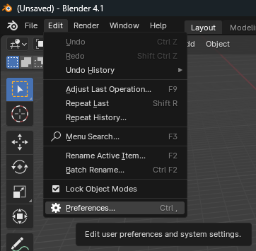
    - Add-ons > Install > Åben ```io_batch_import_objs.py``` > Aktiver ```(2)```
        
        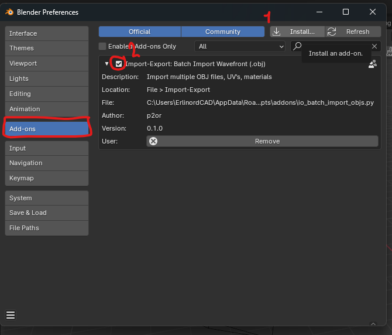

    - File > Import > Wavefront Batch 
        
        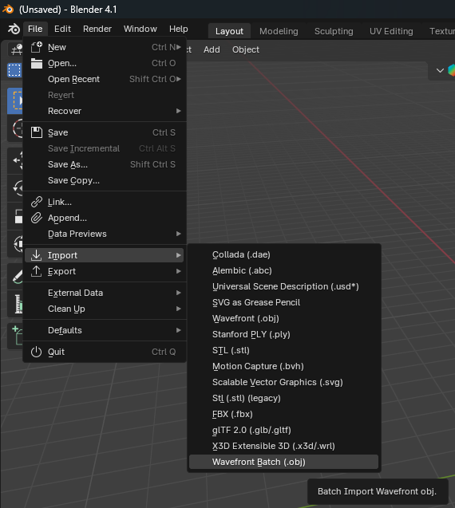


## Slet alle dupletter af materiale:
* Installer ```Eliminate_Material_Duplicates.py``` ved at;
    - Blender > Edit > Preferences 
        
        
    - Add-ons > Install > Åben ```io_batch_import_objs.py``` > Aktiver ```(2)```
        
        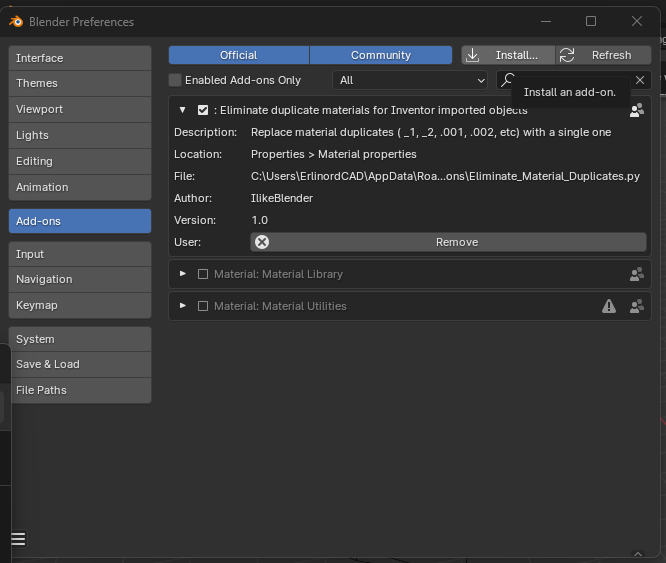

* Bruges ved at vælge alle parter (genvej: ```a```)

    - 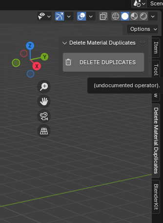

## BlenderKit

Følg vejledningen på https://www.blenderkit.com/

## Renderinger

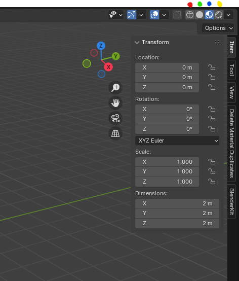

- <span style="color:red">**Rød**</span> viser 'Wireframe'
- <span style="color:green">**Grøn**</span> viser 'Viewport'
- <span style="color:blue">**Blå**</span> er 'Materiale Preview'
- <span style="color:yellow">**Gul**</span> aktiverer 'Render view' 

### Kamera'er
- Marker kameraet, og tryk ```numpad 0```
    
    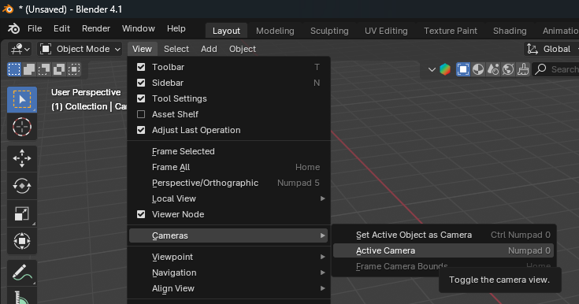
- Kan derefter indstilles til Perspective eller Orthographic
    
    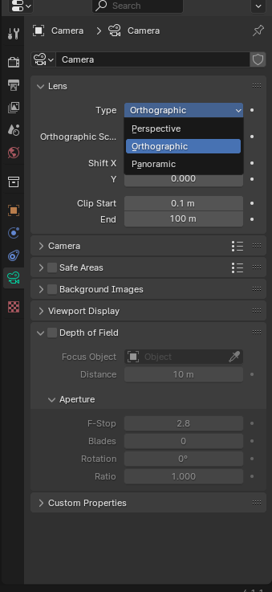


### Indstillinger til Renderinger:
- Brug ```Cycles```, den er bedst.

    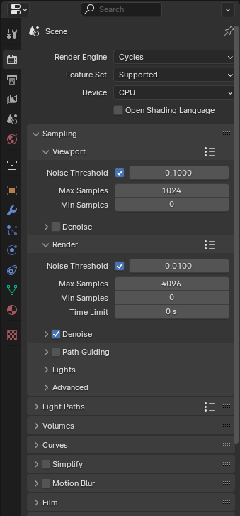
- Indstillinger til output

    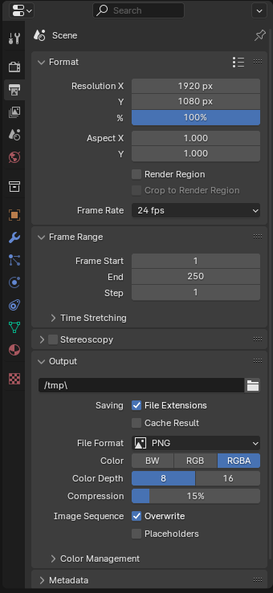

- ```Viewport Render Image``` giver billeder som nedenfor
    
    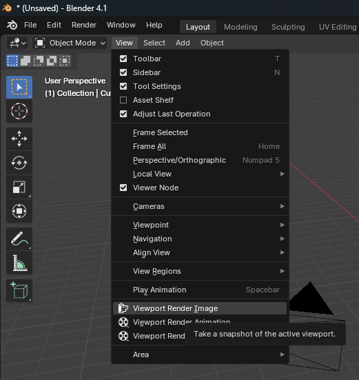
    

- For lave renderinger, som benytter materiale og tager godt med tid. ```Render``` > ```Render Image```. Brug ```alt + s``` for at gemme billeder i Renderings vinduet.

    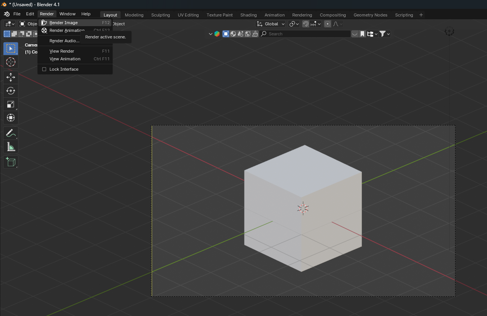


Alt findes som videoer på youtube, og google er din ven. Husk at download nok RAM.